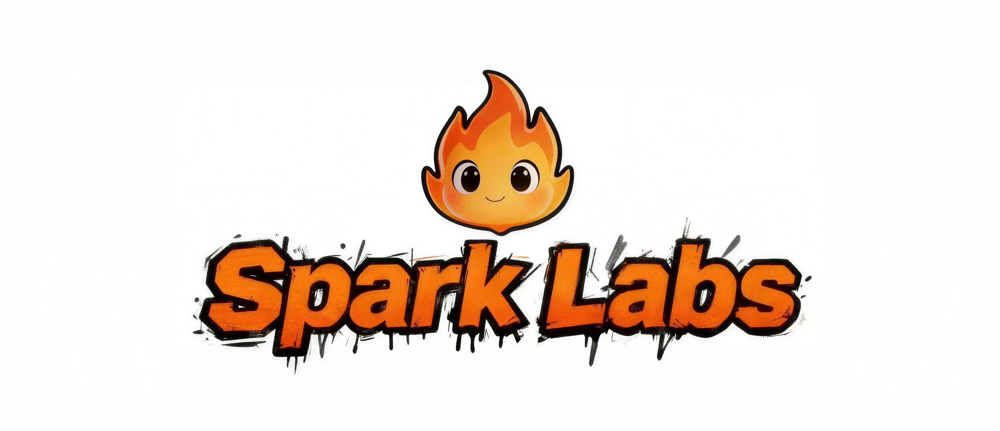

<div align="center">




# GameMind

### The First AI-Native Game Engine. 💥 
### Ignite Your Infinite Play! 🎮


[Website](https://yuan-manx.github.io/SparkLabs/) · [SparkLabs](https://yuan-manx.github.io/SparkLabs/editor.html) · [Quickstart](#quick-start) · [Key Features](#key-features) · [Docs](#documentation) · [Contributing](#contributing)

#### [English](./README.md) | [中文文档](./README_CN.md)

</div>


## Overview

**SparkLabs** is a next-generation AI-native game engine that deeply integrates artificial intelligence capabilities into the core architecture of game development. Unlike traditional game engines that rely on manually coded game logic and predefined pipelines, SparkLabs revolutionizes game development by enabling procedural content generation, intelligent NPC behavior systems, adaptive rendering, and dynamic difficulty adjustment through AI.

The engine features an AI Agent foundation that provides a comprehensive multi-agent orchestration system, hierarchical memory, tool registry, and LLM provider integration — all designed from the ground up for AI-native game development. The web editor provides an intuitive interface for scene design, workflow composition, NPC creation, and narrative editing.

## Key Features

### AI-Native Agent Foundation
- SparkAgent with observe-think-act loop
- Multi-provider LLM integration (OpenAI, Anthropic, DeepSeek, Ollama, local models)
- Hierarchical memory system (short-term, long-term, episodic, semantic, working)
- Tool registry with built-in engine tools for game development
- Multi-agent orchestration with automatic capability matching

### AI-Native Architecture
- Deep integration of AI inference capabilities into core engine architecture
- AI-driven object system and event handling mechanisms
- Support for neural network models

### Neural Rendering Pipeline
- Real-time AI super-resolution (Neural Upscaling)
- AI-based ambient occlusion (N/AO)
- Intelligent anti-aliasing (Neural AA)
- Adaptive rendering based on scene understanding

### Intelligent NPC System
- Neural network-driven NPC decision making with dual-network architecture
- 10-dimensional personality trait system
- Emotional state machine with 7 emotion types
- Memory system with short-term, long-term, episodic, and semantic memory
- Attention mechanism for focus management
- Behavior tree system with selector, sequence, decorator, and parallel nodes
- Context-aware dialogue generation

### Adaptive Gameplay
- Player skill tracking and modeling
- Real-time dynamic difficulty adjustment
- Engagement metrics monitoring
- Personalized player experience optimization

### AI Narrative Engine
- Branching story graph with variable tracking and conditional logic
- Procedural quest generation with 6+ template types
- Dynamic quest customization with context-aware text
- Story node types: Beginning, Plot Point, Choice, Climax, Resolution, Branch

### Smart Asset Management
- AI-powered texture synthesis
- Procedural geometry generation
- Prompt-to-asset conversion system
- Intelligent asset caching

### AI Workflow Canvas
- Node-graph visual programming for AI pipelines
- 20+ built-in node types across 11 categories
- Typed pin connections with type safety
- Topological execution engine
- Categories: Prompt, Image, Text, Video, Audio, Input, Output, Sampling, Latent, ControlNet, Logic, Game

### Intelligent Team Collaboration System
- Three-tiered agent architecture matching real studio hierarchy
  - Tier 1: Directors (Creative Director, Technical Director, Producer)
  - Tier 2: Department Leads (Game Designer, Lead Programmer, Art Director, etc.)
  - Tier 3: Specialists (19 specialist roles)
- Design review and approval workflows
- Code review and quality validation processes
- Quality gate system with 4 standards and 5 metrics

### Web Visual Editor (SparkLabs Editor)
- React + TypeScript + Vite + Tailwind CSS
- 11 editor panels: Dashboard, Game Studio, Templates, Story, Assets, Voice, Storyboard, Video, Workflow, NPC Designer, Agent Panel
- Real-time WebSocket connection to engine backend
- AI Agent chat interface for content generation
- Visual workflow canvas with drag-and-drop nodes
- NPC personality designer with trait visualization
- Story editor with branching narrative support


## Installation

### Building C++ Engine from Source

```bash
# Clone the repository
git clone https://github.com/MeAkash77/GameMind-AI-Platform-Autonomous-NPC-Intelligence-Simulation-Platform.git
cd SparkLabs

# Create build directory
mkdir build && cd build

# Configure with CMake
cmake ..

# Build
cmake --build . --config Release
```

### Setting Up the Official Website

```bash
# Navigate to website directory
cd frontend/website

# Install dependencies
npm install

# Start website server
npm run dev
```

### Setting Up the AI-Native Game Engine Editor

```bash
# Navigate to web editor directory
cd frontend/web

# Install dependencies
npm install

# Start development server
npm run dev

# Build for production
npm run build
```

### Setting Up the AI Backend

```bash
# Install Python dependencies
pip install -r backend/requirements.txt

# Start the backend server
python -m uvicorn backend.app:app --host 0.0.0.0 --port 8091 --reload
```


## Quick Start

### AI Game Engine

```cpp
#include <GameMind.h>

using namespace SparkLabs;

int main() {
    auto scene = new Scene();
    scene->SetName("MyGame");

    auto player = scene->CreateEntity("Player");
    player->SetPosition(Vector3(0.0f, 1.0f, 0.0f));
    player->SetTag("Player");

    auto npc = scene->CreateEntity("NPC");
    npc->SetPosition(Vector3(5.0f, 1.0f, 0.0f));

    auto npcBrain = npc->AddComponent<NPCBrainComponent>();
    npcBrain->LoadModel("models/npc_decision.onnx");

    Engine::GetInstance()->SetScene(scene);
    Engine::GetInstance()->Run();

    return 0;
}
```

### AI Agent System

```python
import asyncio
from sparkai import SparkAgent, LLMProvider, LLMConfig, AgentCapability, create_engine_tools

async def main():
    # Create an AI agent
    agent = SparkAgent(
        name="GameDesigner",
        role="game_designer",
        capabilities=[
            AgentCapability.REASONING,
            AgentCapability.GAMEPLAY_DESIGN,
            AgentCapability.WORLD_BUILDING,
        ],
    )

    # Configure LLM provider
    llm = LLMProvider(LLMConfig(
        provider="openai",
        model="gpt-5.5",
        api_key="your-api-key",
    ))
    await llm.initialize()
    agent.set_llm_provider(llm)

    # Register engine tools
    for tool in create_engine_tools():
        agent.register_tool(tool)

    # Use the agent
    response = await agent.think("Design a boss encounter for a fantasy RPG")
    print(response)

    # Execute an action
    result = await agent.act("create_scene", {"name": "Boss Arena"})
    print(result)

asyncio.run(main())
```

### AI Workflow System

```python
from sparkai import WorkflowGraph, WorkflowNode, WorkflowExecutor, NodeRegistry

# Create workflow graph
graph = WorkflowGraph(name="Image Generation Pipeline")

# Use the node registry to create typed nodes
registry = NodeRegistry.get_instance()

prompt = registry.create_node("text_prompt", name="Landscape Prompt")
prompt.set_property("prompt", "A beautiful landscape at sunset")
prompt.position = [100.0, 100.0]

image_gen = registry.create_node("image_generation", name="Generate Image")
image_gen.set_property("width", 1024)
image_gen.set_property("height", 1024)
image_gen.position = [400.0, 100.0]

save = registry.create_node("save_image", name="Save Result")
save.set_property("output_path", "output/landscape.png")
save.position = [700.0, 100.0]

# Add nodes and connect
graph.add_node(prompt)
graph.add_node(image_gen)
graph.add_node(save)
graph.connect(prompt.id, 0, image_gen.id, 0)
graph.connect(image_gen.id, 0, save.id, 0)

# Execute
executor = WorkflowExecutor()
result = await executor.execute(graph)
```

### AI NPC System

```python
from sparkai import NPCBrain, NPCPersonality, PersonalityTraits, BehaviorTree, BehaviorNode

# Create NPC with personality
personality = NPCPersonality(
    name="Elder Sage",
    traits=PersonalityTraits(
        courage=0.3, curiosity=0.8, aggression=0.1,
        friendliness=0.9, honesty=0.9, intelligence=0.95,
    ),
    background="An ancient keeper of knowledge",
    speech_style="wise",
)

brain = NPCBrain(personality=personality)

# Add goals
brain.add_goal("Share wisdom", priority=0.8)
brain.add_goal("Protect library", priority=0.9)

# Create behavior tree
tree = BehaviorTree()
root = BehaviorNode(name="Root", node_type="selector")
tree.set_root(root)
brain.set_behavior_tree(tree)

# Make decisions
decision = await brain.decide({"player_action": "asks about ancient artifact"})
dialogue = await brain.generate_dialogue("Tell me about the ancient artifact")
```

## Architecture Overview

```
┌─────────────────────────────────────────────────────────────────┐
│                    SparkLabs Web Editor                         │
│  React + TypeScript + Vite + Tailwind CSS                      │
│  ┌──────────┐ ┌──────────┐ ┌──────────┐ ┌──────────────────┐   │
│  │  Game    │ │ Workflow │ │   NPC    │ │     Agent        │   │
│  │  Studio  │ │  Canvas  │ │ Designer │ │     Panel        │   │
│  └──────────┘ └──────────┘ └──────────┘ └──────────────────┘   │
├─────────────────────────────────────────────────────────────────┤
│                    Backend API (FastAPI)                         │
│  WebSocket │ REST API │ Agent Routes │ Engine Routes            │
├─────────────────────────────────────────────────────────────────┤
│                    sparkai (Python AI Layer)                     │
│  ┌─────────────┐ ┌─────────────┐ ┌─────────────────────────┐   │
│  │   Agent     │ │  Workflow   │ │       NPC System        │   │
│  │  Foundation │ │   Engine    │ │  Brain │ Memory │ Emotion│   │
│  │ LLM│Memory  │ │ Graph│Exec  │ │  Behavior │ Personality │   │
│  │ Tools│Orch.  │ │ Registry   │ │  Dialogue │ Goals      │   │
│  └─────────────┘ └─────────────┘ └─────────────────────────┘   │
│  ┌─────────────┐ ┌─────────────┐ ┌─────────────────────────┐   │
│  │ Narrative   │ │   Team      │ │       Engine            │   │
│  │ Story│Quest │ │ Dir│Lead    │ │  Scene │ Entity         │   │
│  │ Branch│Var  │ │ Spec│Quality│ │  Component System       │   │
│  └─────────────┘ └─────────────┘ └─────────────────────────┘   │
├─────────────────────────────────────────────────────────────────┤
│                    C++ Core Engine Layer                         │
│  ┌──────────┐ ┌──────────┐ ┌──────────┐ ┌──────────────────┐   │
│  │  Scene   │ │ Resource │ │ Physics  │ │   AI Runtime     │   │
│  │ Manager  │ │ Manager  │ │  Engine  │ │ ONNX │ Neural    │   │
│  └──────────┘ └──────────┘ └──────────┘ └──────────────────┘   │
├─────────────────────────────────────────────────────────────────┤
│                    Neural Rendering Pipeline                     │
│  Classical Render → Neural AA → Neural AO → Neural Upscale     │
├─────────────────────────────────────────────────────────────────┤
│                    Platform Layer                                │
│         Windows | macOS | Linux | Web | Mobile                  │
└─────────────────────────────────────────────────────────────────┘
```

## Documentation

For full documentation, see the [docs](./docs/) directory:
- [API Reference](./docs/API_REFERENCE.md)
- [Architecture](./docs/ARCHITECTURE.md)
- [AI System](./docs/AI_SYSTEM.md)
- [Building Instructions](./docs/BUILD_INSTRUCTIONS.md)

## Contributing

Contributions are welcome! Please read our contributing guidelines before submitting pull requests.

## License

SparkLabs Engine is licensed under the MIT License. See [LICENSE](./LICENSE) for details.

## ⭐ Star History

If you like this project, please ⭐ star the repo. Your support helps us grow!
